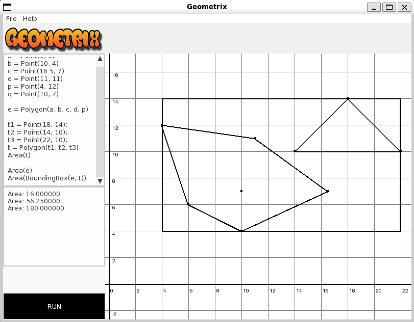

# Trabalho Final: Geometrix
O projeto em questão se trata da elaboração de uma aplicação para executar e visualizar estruturas e algoritmos de geometria computacional, a partir da qual serão evidenciados os conhecimentos 
e competências adquiridos na disciplina de Programação e Desenvolvimento de Software II, atrelados ao paradigma de Orientação a Objetos, Boas Práticas de Programação e Corretude.

## Estrutura e Funcionamento do Programa
O programa é organizado em arquivos .hpp e .cpp, seguindo uma abordagem modular para cada responsabilidade específica. 

A aplicação é projetada de forma que os usuários possam facilmente adicionar pontos, segmentos e polígonos através da aba de input, visualizando graficamente no grid adjacente.
Ademais, é possível executar algoritmos de geometria computacional e ver os resultados na tela e na aba de output. 

Além de permitir adicionar/excluir objetos, é possível salvar/carregar o estado do programa, proporcionando flexibilidade. 

O programa também oferece interatividade com zoom in/out no grid e é responsivo.

Em suma, a aplicação oferece uma experiência de manipulação intuitiva de elementos geométricos, aplicação de funções e interação dinâmica com o ambiente gráfico.



## Principais Dificuldades
Enfrentamos desafios significativos ao lidar com a diversidade das entradas dos usuários, buscando equilibrar liberdade e segurança:
integrar o Lua como parser e implementar exceções específicas foram passos cruciais para assegurar a integridade do programa.

Aprender a utilizar bibliotecas gráficas representou outro obstáculo, dada a novidade dos conceitos e a dificuldade própria atrelada à cada biblioteca.

A primeira experiência do trabalho de desenvolvimento em grupo também se configurou como desafio para os integrantes.

## Dependências
O presente trabalho utiliza as seguintes linguagem, ferramentas e bibliotecas:
* Linguagem: C++17
* Compilação: Make
* Documentação: Doxygen
* Testes Unitários: Doctest
* Cobertura: gcovr
* Interface gráfica: SFML 2.5.1 / TGUI 1.0
* Parsing: lua5.3
### Instalação das Dependências
A seguir, um script para Linux (Ubuntu 22.04+)
````
$ sudo apt-get install libsfml-dev
$ sudo apt-get install libtgui-1.0-dev
$ sudo apt-get install liblua5.3-dev
$ sudo apt-get install doxygen
$ sudo apt-get install gcovr
````
## Compilação
````
$ make
````
## Execução do programa
````
$ make run
````
## Funcionalidades (interação com o Geometrix)
### Criação de Estruturas
````
Point() => Recebe coordenadas
Segment() => Recebe par de pontos
Polygon() => Recebe conjunto de pontos
````
### Principais Algoritmos
````
ConvexHull() => Recebe conjunto de quaisquer estruturas (objects)
BoundingBox() => Recebe conjunto de quaisquer estruturas (objects)
Area() => Recebe um polígono
````
## Removação de arquivos auxiliares
````
$ make clear
````
## Gerar documentação
````
doxygen Doxyfile
````
## Gerar relatório de cobertura
````
gcovr -r . --exclude="tests/doctest.h"
````
